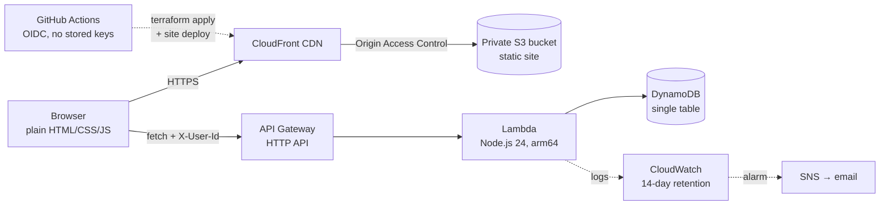

# StudyBuddy Timer

A study timer that keeps you honest. Press **Start** for a 50-minute focus
block; a 10-minute break follows automatically. Every *completed* focus
block is saved, and a GitHub-style contribution grid shows the last 26
weeks of studying — one square per day, darker green for more minutes.

**Live:** https://d31po0seua3i7u.cloudfront.net *(append `?fast=1` to try
it at 60× speed — every "minute" lasts one second)*

Built as a learning project with two goals: a deployed, operated piece of
serverless infrastructure, and a codebase small enough to explain every
line of in an interview. The build log in [NOTES.md](NOTES.md) documents
each step in plain language, including the design decisions and the five
interview questions each stage should prepare you for.

## Architecture



- **Frontend** ([site/](site/)): no framework, no build step, no npm. Four
  script files served as-is. The timer computes remaining time from an
  end-timestamp, so throttled background tabs and page refreshes can't
  make it drift.
- **API** ([backend/](backend/)): one Lambda behind an HTTP API.
  `POST /sessions` (idempotent via a DynamoDB conditional write) and
  `GET /sessions?from=...` (a sort-key range query, never a scan). All
  validation is server-side; the deploy zip has zero dependencies — the
  AWS SDK ships inside the Lambda runtime.
- **Data**: one DynamoDB table, on-demand billing. `PK = USER#<id>`,
  `SK = SESSION#<date>#<uuid>` — the date-first sort key is what makes
  "everything since March" a cheap range read, and the layout leaves room
  for accounts and friends without a migration.
- **Infrastructure** ([infra/](infra/)): everything is Terraform; nothing
  was clicked together in the console. State lives in a versioned S3
  bucket (created by a separate [bootstrap](infra/bootstrap/) config so
  destroying the app can't destroy its own state) with lockfile locking.
- **CI/CD** ([.github/workflows/](.github/workflows/)): pull requests run
  tests + `fmt`/`validate`/`plan`; pushes to main run tests, `terraform
  apply`, and the site deploy. GitHub authenticates to AWS through an
  OIDC role scoped to this repository — no access keys exist anywhere.

## Design decisions worth defending

| Decision | Trade-off accepted |
|---|---|
| Anonymous identity: a UUID in localStorage, sent as `X-User-Id` | Phase-1 simplicity. History is tied to one browser, and anyone holding the ID can read/write that history. Phase 2 (Cognito accounts) replaces it. |
| Async storage interface from day one, while it was still localStorage | Callers awaited a value that was already there — in exchange, swapping in the network API later changed one file and zero call sites. |
| Session IDs minted when a block *starts*, saves idempotent everywhere | A retry, refresh, or double-tab can never double-count; the same rule is enforced browser-side, and atomically in DynamoDB. |
| Runtime-included AWS SDK, no bundling | Simplest possible deploys; accepts that AWS controls the SDK minor version. |
| Bounded everything: request bodies, `from` age, items per read, sessions per day | Added after an adversarial review showed unbounded reads could be weaponized against a fixed-credit account. Details in NOTES.md. |
| `us-east-1` for everything | CloudFront certificates must live there anyway; one region beats two. |

## Run it locally

No installs needed for the frontend — any static file server works:

```bash
python3 -m http.server 8123 --directory site
```

then open http://localhost:8123/?fast=1. (Opening `index.html` straight
from disk shows the timer but can't reach the API: local files send
`Origin: null`, which the API's CORS policy refuses.)

Backend tests (Node 24, no packages):

```bash
node --test backend/test/*.test.mjs
```

## Deploy

CI deploys `main` automatically. By hand:

```bash
terraform -chdir=infra apply     # infrastructure
./scripts/deploy.sh              # site files + cache invalidation
```

First-time setup: apply `infra/bootstrap` once (the state bucket), then
`terraform -chdir=infra init`.

## Cost

Effectively $0/month at hobby scale: S3, CloudFront, Lambda, DynamoDB,
API Gateway, and CloudWatch all sit far inside their free tiers at this
traffic. The main cost *risks* are handled structurally: API throttling
(5 req/s), bounded reads per request, log retention capped at 14 days,
and nothing that bills by the hour.

## Known limits

- One browser = one identity; clearing site data orphans your history
  (the ID is gone, the sessions remain unreachable). Real accounts are
  phase 2.
- The anonymous API cannot stop someone inventing user IDs; abuse is
  rate-limited and per-request-bounded rather than impossible.
- Totals cover the last ~400 days (the API's query window), not all time.
- A focus block completed while the tab is closed on a dead battery is
  lost; one queued on a flaky network is retried and kept.

## How AI was used

This project was pair-built with Claude (Anthropic), with the human
directing: staged plans were approved before code was written, and every
AWS-touching command was explained in plain words first. Verification was
not vibes: 43 unit tests via `node --test`; a multi-agent adversarial
review before the backend deployed (three independent reviewers, every
finding cross-examined by a skeptic agent — five findings confirmed and
fixed, including an unbounded-read blocker, one refuted); and live
end-to-end checks against the deployed system (session → DynamoDB item,
duplicate-send stored once, direct-S3 access denied, CORS and throttle
behavior). The commit history reads as the build order, and
[NOTES.md](NOTES.md) records what each step created and why.
